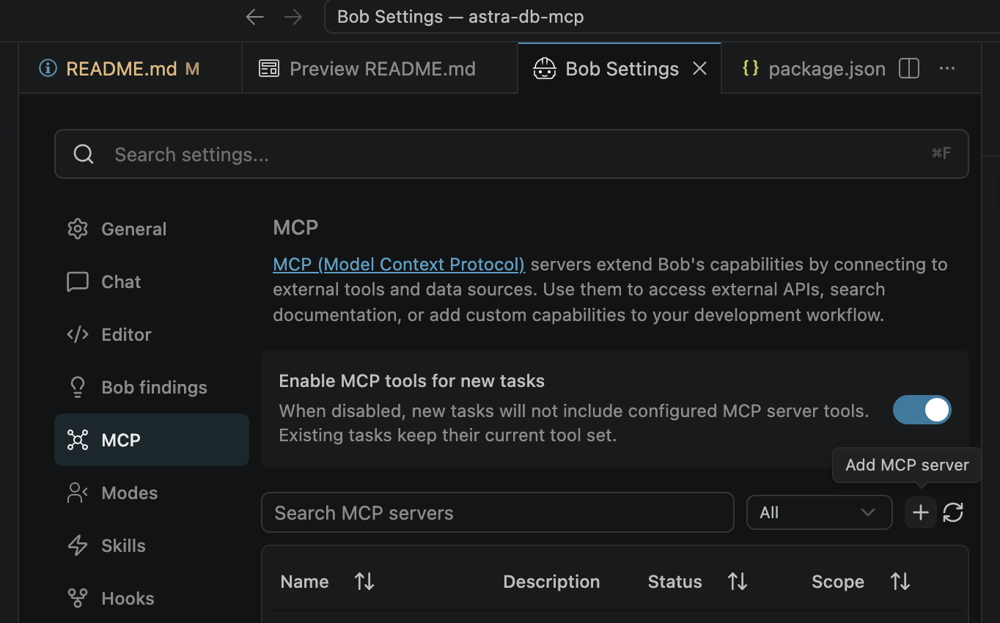

# Astra DB MCP Server

A Model Context Protocol (MCP) server for interacting with Astra DB. MCP extends the capabilities of Large Language Models (LLMs) by allowing them to interact with external systems as agents.

## Prerequisites

You need to have a running Astra DB database. If you don't have one, you can create a free database [here](https://astra.datastax.com/register). From there, you can get two things you need:

1. An Astra DB Application Token
2. The Astra DB API Endpoint

To learn how to get these, please [read the getting started docs](https://docs.datastax.com/en/astra-db-serverless/api-reference/dataapiclient.html#set-environment-variables).

## Adding to an MCP client

Here's how you can add this server to your MCP client.

### IBM Bob

For **[IBM Bob](https://bob.ibm.com)** IDE, follow the procedure at [this documentation](https://bob.ibm.com/docs/ide/configuration/mcp/mcp-in-bob).



For **[IBM Bob](https://bob.ibm.com)** Shell, follow the procedure at [this documentation](https://bob.ibm.com/docs/shell/configuration/mcp/mcp-bobshell#transport-types).

### Claude Desktop


To add this to [Claude Desktop](https://claude.ai/download), go to Preferences -> Developer -> Edit Config and add this JSON blob to `claude_desktop_config.json`:

```json
{
  "mcpServers": {
    "astra-db-mcp": {
      "command": "npx",
      "args": ["-y", "@datastax/astra-db-mcp"],
      "env": {
        "ASTRA_DB_APPLICATION_TOKEN": "your_astra_db_token",
        "ASTRA_DB_API_ENDPOINT": "your_astra_db_endpoint"
      }
    }
  }
}
```

**Optional Keyspace Configuration:**
By default, this server uses the keyspace configured in the underlying Astra DB library (typically `default_keyspace`). If you need to connect to a specific keyspace, you can add the `ASTRA_DB_KEYSPACE` variable to the `env` object above, like so:

```json
"env": {
  "ASTRA_DB_APPLICATION_TOKEN": "your_astra_db_token",
  "ASTRA_DB_API_ENDPOINT": "your_astra_db_endpoint",
  "ASTRA_DB_KEYSPACE": "your_desired_keyspace"
}
```

**Windows PowerShell Users:**
`npx` is a batch command so modify the JSON as follows:

```json
  "command": "cmd",
  "args": ["/k", "npx", "-y", "@datastax/astra-db-mcp"],
```

### Cursor


To add this to [Cursor](https://www.cursor.com/), go to Settings -> Cursor Settings -> MCP

From there, you can add the server by clicking the "+ Add New MCP Server" button, where you should be brought to an `mcp.json` file.

> **Tip**: there is a `~/.cursor/mcp.json` that represents your Global MCP settings, and a project-specific `.cursor/mcp.json` file
> that is specific to the project. You probably want to install this MCP server into the project-specific file.

Add the same JSON as indiciated in the Claude Desktop instructions.

Alternatively you may be presented with a wizard, where you can enter the following values (for Unix-based systems):

- Name: Whatever you want
- Type: Command
- Command:

```sh
env ASTRA_DB_APPLICATION_TOKEN=your_astra_db_token ASTRA_DB_API_ENDPOINT=your_astra_db_endpoint npx -y @datastax/astra-db-mcp
```

*Note: `ASTRA_DB_KEYSPACE` is optional. If omitted, the default keyspace configured in the Astra DB library will be used.*

Once added, your editor will be fully connected to your Astra DB database.

## Available Tools

The server provides a comprehensive suite of tools spanning Collections, Vector Search, Tables, Keyspaces, and Administration:

### 📁 Collections & Documents
- `GetCollections`: Get all collections in the active keyspace
- `GetCollectionInfo`: Inspect collection options, vector settings, and default ID configuration
- `CreateCollection`: Create a collection with vector options, distance metrics (`cosine`, `euclidean`, `dot_product`), and auto-vectorize configurations
- `UpdateCollection`: Update or rename a collection
- `DeleteCollection`: Delete a collection
- `EstimateDocumentCount`: Get an approximate count of documents in a collection
- `ListRecords`: List records with optional sorting, pagination (`skip`), and projection
- `GetRecord`: Get a specific record by ID
- `CreateRecord`: Insert a single document
- `UpdateRecord`: Update a record
- `DeleteRecord`: Delete a record by ID
- `FindRecord`: Find records by exact field value match
- `FindWithFilter`: Rich querying with MongoDB-style filter operators (`$and`, `$or`, `$gt`, `$in`, `$exists`, etc.)
- `FindDistinctValues`: Find distinct values for a specific field in a collection
- `BulkCreateRecords`: Insert multiple documents in batch
- `BulkUpdateRecords`: Update multiple documents in batch
- `BulkDeleteRecords`: Delete multiple documents in batch

### 🧠 Vector Search & Reranking
- `FindWithVector`: Dense vector similarity search with optional metadata filters, similarity scores, and projection
- `FindWithVectorize`: Natural language search query using Astra DB Vectorize serverless embeddings
- `FindAndRerank`: Hybrid search (lexical + dense vector / auto-vectorize) with server-side reranking scores
- `VectorSearch`: Vector similarity search with minScore threshold and projection
- `HybridSearch`: Combine dense vector similarity and text search with weighted scoring

### 📊 Tables (Astra DB Data API v2)
- `ListTables`: List all structured tables in the keyspace
- `CreateTable`: Create a typed table with column definitions and primary keys
- `AlterTable`: Add or drop columns (including vector columns)
- `DropTable`: Drop a table
- `QueryTable`: Query table rows with filters, sorting, projection, and pagination
- `InsertTableRow`: Insert a single row or batch of rows into a table
- `UpdateTableRow`: Update matching rows in a table
- `DeleteTableRow`: Delete matching rows from a table
- `CreateTableIndex`: Create a secondary index on a table column
- `CreateTableVectorIndex`: Create a vector index on a table column with similarity metrics

### 🔑 Keyspaces & Administration
- `ListKeyspaces`: List all keyspaces in the database
- `CreateKeyspace`: Create a new keyspace with optional automatic switching
- `DropKeyspace`: Drop a keyspace
- `UseKeyspace`: Switch the active working keyspace for subsequent operations
- `GetCurrentKeyspace`: Inspect the active keyspace name
- `ListEmbeddingProviders`: Discover supported embedding models and providers
- `ListRerankingProviders`: Discover supported reranking models
- `GetDatabaseInfo`: Retrieve environment metadata (ID, region, status, keyspaces)

### 🛠️ Utilities
- `OpenBrowser`: Open a browser for authentication/setup
- `HelpAddToClient`: Assistance with MCP client installation

## Changelog
All notable changes to this project will be documented in [this file](./CHANGELOG.md).
The format is based on [Keep a Changelog](https://keepachangelog.com), and this project adheres to [Semantic Versioning](https://semver.org/spec/v2.0.0.html).


## Running evals

The evals package loads an mcp client that then runs the index.ts file, so there is no need to rebuild between tests. You can load environment variables by prefixing the npx command. Full documentation can be found [here](https://www.mcpevals.io/docs).

```bash
OPENAI_API_KEY=your-key  npx mcp-eval evals.ts tools.ts
```
## ❤️ Contributors

[](https://github.com/datastax/astra-db-mcp/graphs/contributors)

## Badges
[](https://glama.ai/mcp/servers/tigix0yf4b)

[](https://mseep.ai/app/datastax-astra-db-mcp)

[](https://mseep.ai/app/932eb437-ab8e-4cf4-bbb5-1b3dbdb9f0aa)
---